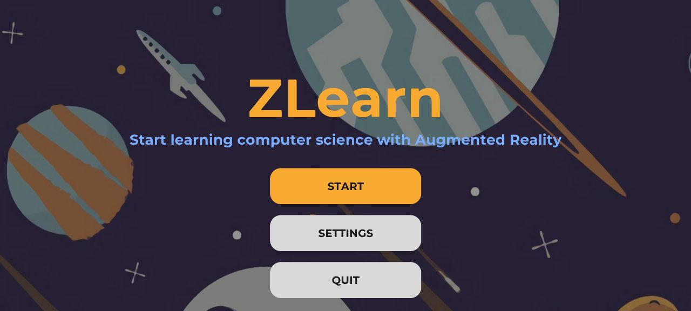
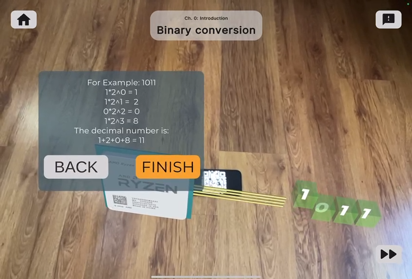
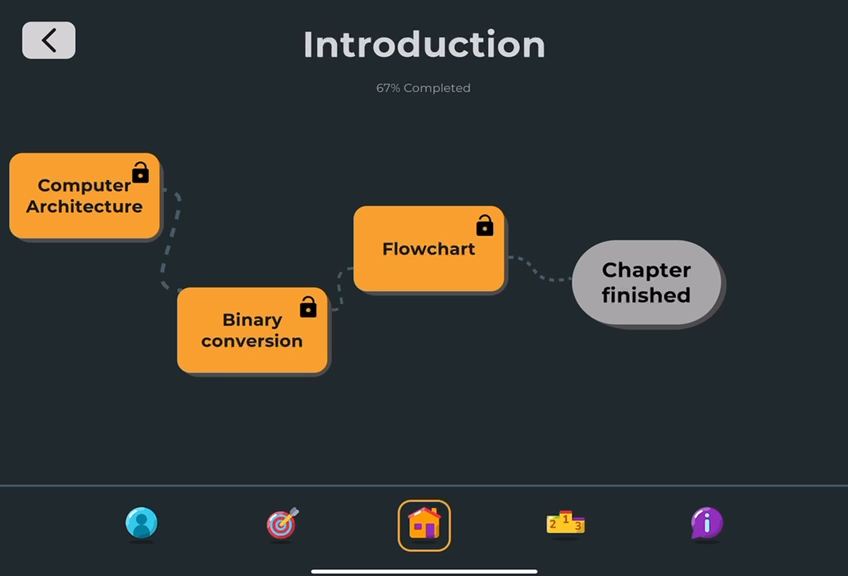
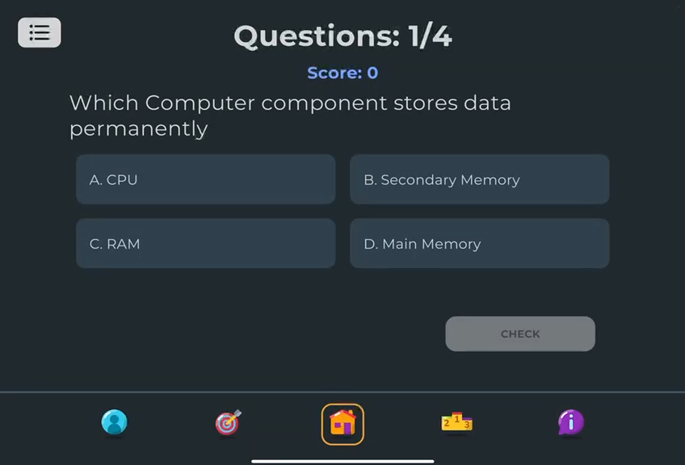
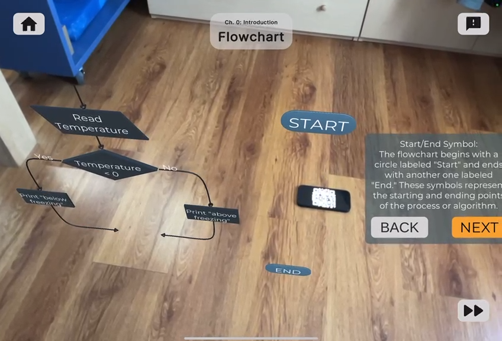
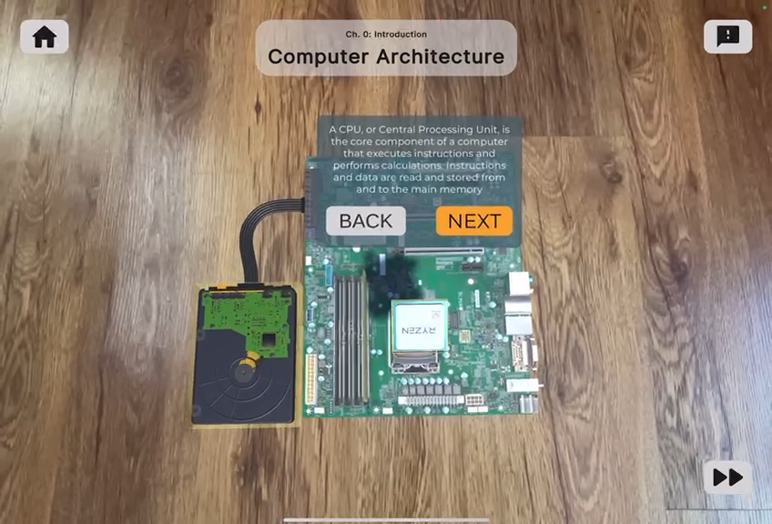

# ZLearn

## Unity, C#, Augmented Reality

ZLearn is a software made for the Human Computer Interaction course. It allows users to study Computer Science topics in a more interactive way through Augmented Reality.

## Project Information

### 1. Project Name
We chose the name ‘ZLearn’ for our project because of its modern appeal and simplicity. The letter ‘Z’, emblematic of Generation Z, combined with the word ‘Learn’, reflects our vision for a technologically advanced and accessible platform, transforming how students engage with computer science topics.

### 2. Value Proposition
Our value proposition is: ‘The new generation way of learning computer science’. We believe that traditional education approaches may not be as impactful for the new generations of students. ZLearn is the answer to this challenge, offering a revolutionary educational experience tailored to the needs and preferences of Generation Z. With an emphasis on interactive content, and a user-friendly interface, ZLearn transcends the limitations of conventional learning.

### 3. Team Members
We are four students from the Master’s Degree in Computer Engineering at Politecnico di Torino. Our names are:
- Sante Laera
- Bruno Palermo
- Alessio Rosiello
- Carlos Valeriano

### 4. Group Name
The name of our group is ‘No Thinkers’ which represents our dedication to approaching this project with fresh perspectives and making creativity a key element in everything we do.

## Problem/Solution Overview
Understanding computer science topics can be really challenging initially. Our solution aims to improve the learning experience for abstract and technical concepts by incorporating visualization through augmented reality animations. Additionally, we leverage gamification to boost students’ engagement, making the educational process more interactive and enjoyable.

## Screenshots

### Home Page 


### Binary Conversion


### Courses Flow


### Example Test


### Flowchart


### Introduction to Computer


## Installation
To install and run the ZLearn software, follow these steps:

1. Clone the repository:
    ```bash
    git clone https://github.com/Frirhos-he/ZLEARN.git
    ```

2. Open the project in Unity.

3. Build and run the project on your target device (preferably IOS tablet).

## Usage
- Open the app and navigate through the available courses.
- Use the augmented reality feature to visualize computer science concepts.
- Take tests to assess your understanding of the topics.t.

## License
This project is licensed under Creative Commons Attribution-NonCommercial-NoDerivatives 4.0 International (CC BY-NC-ND 4.0) license.

## Contact
If you have any questions or suggestions, feel free to contact me at:

- Bruno Palermo - bruno2001@hotmail.it